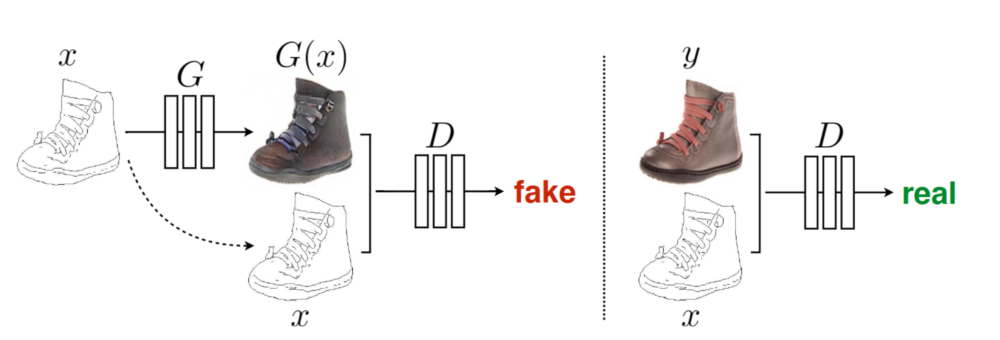
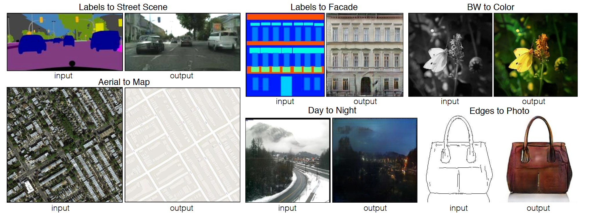
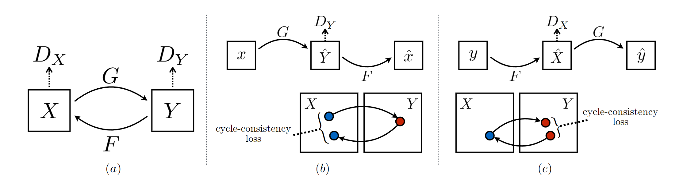
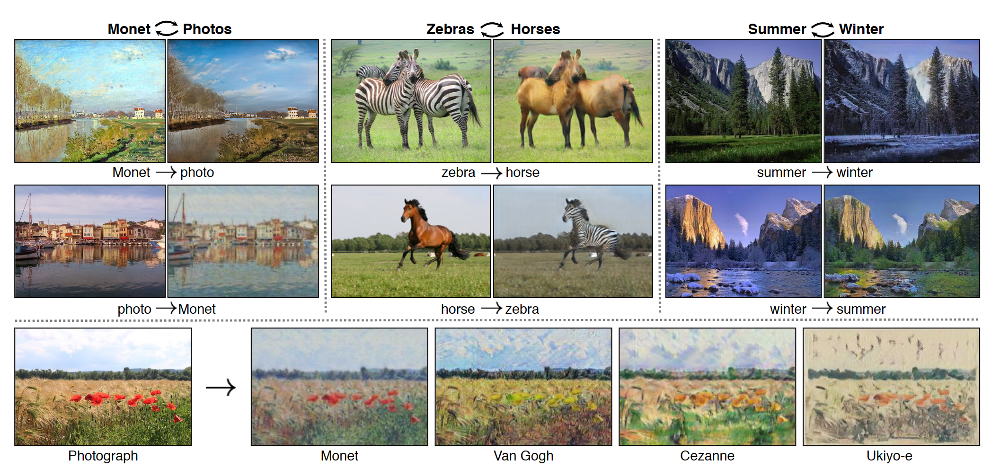
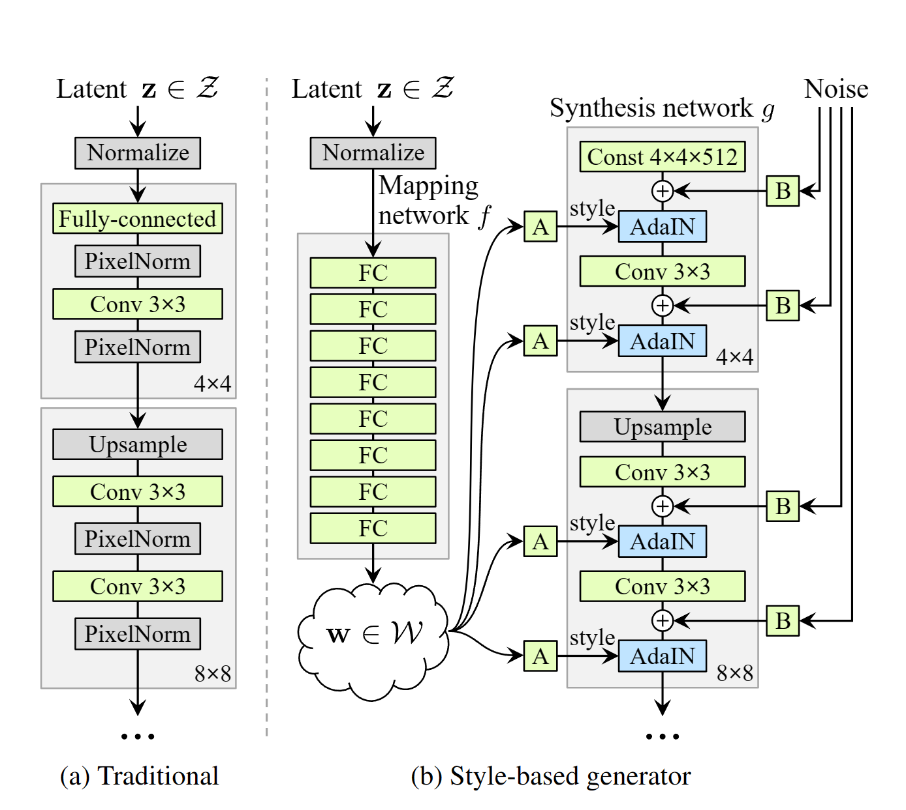

# GAN

## DCGAN

**年份：**2016

**贡献：**将深度卷积网络应用到GAN中

## Pix2Pix

**年份：**2018

**解决问题：**有配对图像的点对点图像生成

**特点：**是一种条件式生成GAN

**目标：**$\{x,z\}\rightarrow y$

- $x$：源图像，作为条件
- $z$：潜变量
- $y$：目标图像

**判别器：**判断$x$是否由与$y$配套

**生成器：**U-Net

**损失函数：**除了对抗损失外还引入传统的距离损失，希望模型不光是能骗过判别器，更能生成质量好的图像。
$$
L_{cGAN}(G,D)=E_{x,y}[\log D(x,y)]+E_{x,z}[\log (1-D(x,G(x,z)))]
$$

$$
L_{L1}(G)=E_{x,y,z}[||y-G(x,z)||_1]
$$

$$
G^*=\arg \min_G \max_D L_{cGAN}(G,D) + \lambda L_{L1}(G)
$$

**效果图：**

## CycleGAN

**年份：**2020

**解决问题：**无配对图像的图像类风格迁移

**特点：**包含两个生成器$G,F$，两个判别器$D_X,D_Y$, 约束要求$x=F(G(x))$，$y=G(F(y))$

**损失函数：**

- 对抗损失

$$
L_{GAN}(G,D_Y,X,Y)=E_y[\log D_Y(y)]+E_x[\log (1-D_Y(G(x)))]
$$

$$
L_{GAN}(F,D_X,Y,X)=E_x[\log D_X(x)]+E_y[\log (1-D_X(F(y)))]
$$

- 循环损失

$$
L_{cyc}(G,F)=E[{||F(G(x))-x||_1}]+E[{||G(F(y))-y||_1}]
$$

- 总损失

$$
L(G,F,D_X,D_Y)=L_{GAN}(G,D_Y,X,Y)+L_{GAN}(F,D_X,Y,X)+\lambda L_{cyc}(G,F)
$$

**效果图：**

## Style GAN

**贡献：**提出了一种生成器结构

**结构：**$z$通过非线性变换映射到$w$，$w$构成对于生成网络中间层的仿射变换，同时在生成网络的每一层添加噪声

优势：

- $w$不一定遵循正态分布

- 可以通过控制$\omega'=\overline\omega+\phi(\omega-\overline\omega)$来调整控制的程度

- 噪声的加入可以调整图像的细节变化

- 可以用两个潜变量空间来进行图像的融合，具体而言图像通过$w_1$后再通过$w_2$

  