# CMS进阶调研

## TMI

| 论文名                                                       | 链接    | 任务 |                             方法                             | 下游任务 |                            数据集                            | 数据描述                                                     | 时间 | 发表 |
| ------------------------------------------------------------ | ------------------------------------------------------------ | :-------------------------------------------------------: | :----------------------------------------------------------: | :----------------------------------------------------------: | :----------------------------------------------------------: | ------------------------------------------------------------ | :--: | :--: |
| CMOS-GAN: Semi-Supervised Generative Adversarial Model for Cross-Modality Face Image Synthesis | https://ieeexplore.ieee.org/stamp/stamp.jsp?tp=&arnumber=9975261 |                      跨膜态人脸合成                       | GAN+对比学习（真实图像与源模态和目标模态均通过生成器后进行对比学习） |                              无                              |                              略                              | 略                                                           | 2023 | TMI  |
| Multi-Modality MR Image Synthesis via Confidence-Guided Aggregation and Cross-Modality Refinement | https://ieeexplore.ieee.org/stamp/stamp.jsp?tp=&arnumber=9439166 |                  MRI （T1+T2生成Flair）                   | GAN,网络自己生成注意力map，感觉很low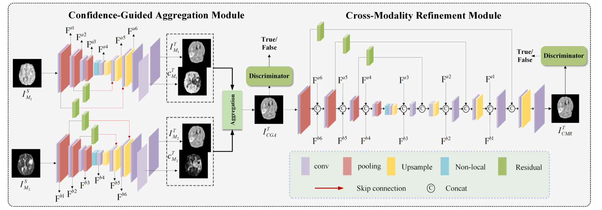 |                              无                              |                            BraTs                             | 略                                                           | 2022 | TMI  |
| CROSS-MODALITY AUGMENTATION OF BRAIN MR IMAGES USING A NOVEL PAIRWISE GENERATIVE ADVERSARIAL NETWORK FOR ENHANCED GLIOMA CLASSIFICATION | https://ieeexplore.ieee.org/stamp/stamp.jsp?tp=&arnumber=8803808 |                     T1-CE、T2、Flair                      | 两个生成器的GAN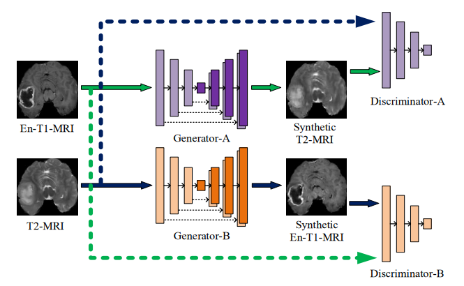 |                        神经胶质瘤分类                        |                TCGA-GBM,TCGA-LGG(BraTs的来源)                | 预处理方法：配准，偏置场校正，头骨剥离，2D脑切片提取，归一化（ 工具包：FSL ， ANTs ） | 2019 | TMI  |
| Anatomy-Regularized Representation Learning for Cross-Modality Medical Image Segmentation | https://ieeexplore.ieee.org/stamp/stamp.jsp?tp=&arnumber=9201096 |                         MRI to CT                         |                      Cycle-GAN+分割网络                      |                   颅骨分割和心脏亚结构分割                   |                         ADNI、CQ500                          | 略                                                           | 2020 | TMI  |
| Sample-Adaptive GANs: Linking Global and Local Mappings for Cross-Modality MR Image Synthesis | https://ieeexplore.ieee.org/stamp/stamp.jsp?tp=&arnumber=8970559 |                            MRI                            | GAN的生成器中间层加了一个KNN聚类，同时独立评估了病变区域的PSNR与SSIM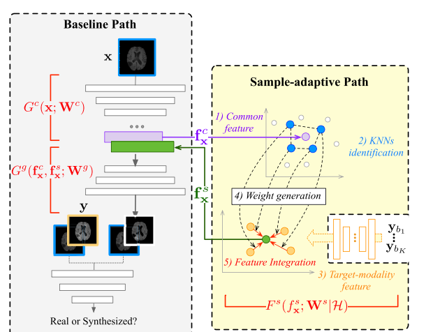 |                                                              |           SISS2015（中风病变）、BraTs（肿瘤病变）            | SISS包含T1、T2、Flair、DWI（n=28）                           | 2020 | TMI  |
| Multi-scale Transformer Network with Edge-aware Pre-training for Cross-Modality MR Image Synthesis | https://ieeexplore.ieee.org/stamp/stamp.jsp?tp=&arnumber=10158035 |                     MRI (T1,T2,T1CE)                      | MAE+ViT+预训练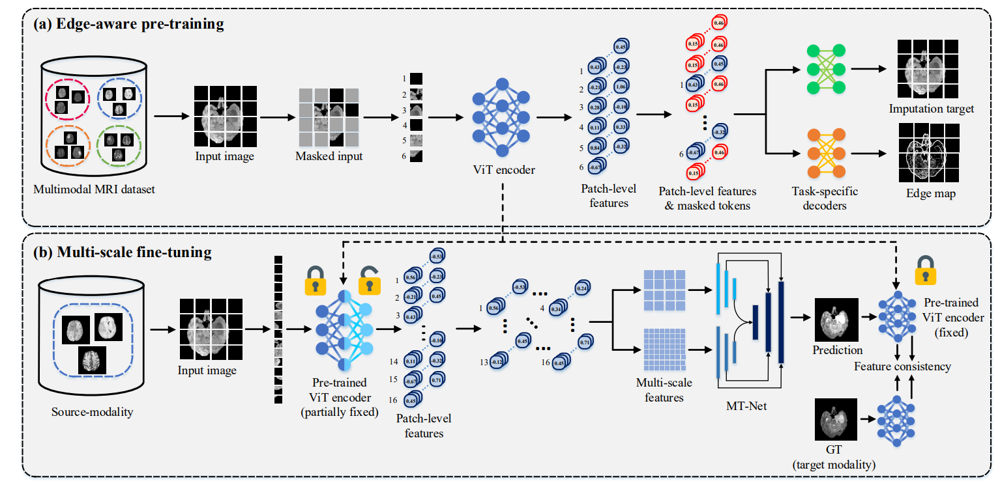 |                      无，但溶解实验很多                      |          BraTS2020、ISLES2015（T1、T2、DWI、FLAIR）          |                                                              | 2023 | TMI  |
| Unsupervised Learning-Based Cross-Modal Transformation of Brain MR-CT Image | https://ieeexplore.ieee.org/stamp/stamp.jsp?tp=&arnumber=10212625 |                         MRI to CT                         | Unet+ViT+CycleGAN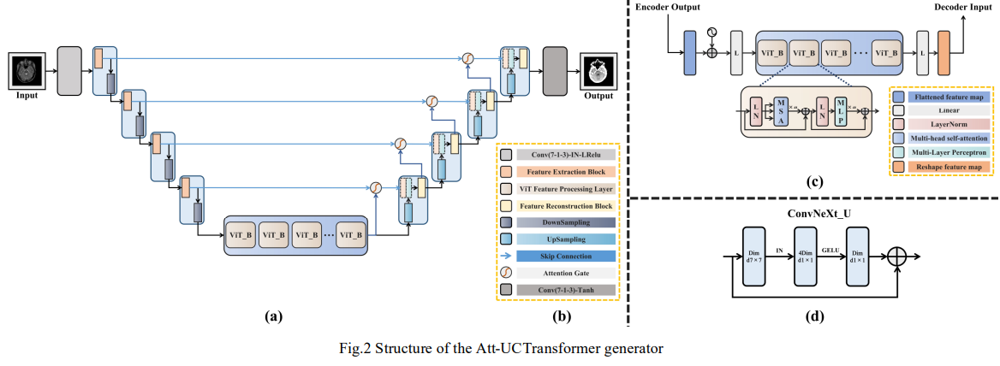 |                              无                              | 数据集来源于文章MR‐based synthetic CT generation using a deep convolutional... | 367，文章有预处理操作                                        | 2023 | TMI  |

总结：TMI基本都是MRI或者CT的迁移

## MICCAI

| 论文名                                                       | 链接    | 任务 |                             方法                             | 下游任务 |                            数据集                            | 数据描述 | 时间 |  发表  |
| ------------------------------------------------------------ | ------------------------------------------------------------ | :-------------------------------------------------------: | :----------------------------------------------------------: | :----------------------------------------------------------: | :----------------------------------------------------------: | ------------------------------------------------------------ | :--: | :----: |
| CoLa-Diff: Conditional Latent Diffusion Model for Multi-Modal MRI Synthesis | https://arxiv.org/abs/2303.14081                             |                        MRI模态生成                        | LDM+将U-net的跨层连接添加滤波+添加多模态条件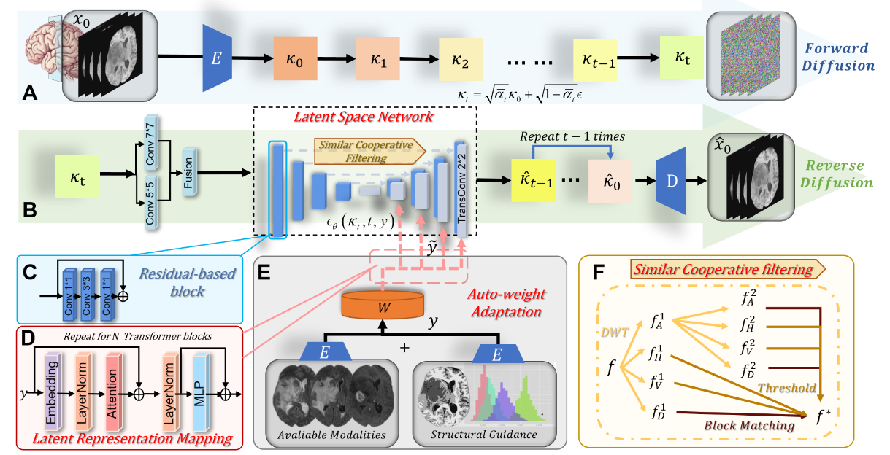 |                              无                              |                          BraTs、IXI                          | BraTs来源于神经胶质瘤患者，IXI来自健康大脑                   | 2023 | MICCAI |
| Contrastive Diffusion Model with Auxiliary Guidance for Coarse-to-Fine PET Reconstruction | https://arxiv.org/pdf/2308.10157.pdf                         |                  低剂量PET重建高剂量PET                   | Diffusion+对比学习+辅助信息（相邻切片、频域信息）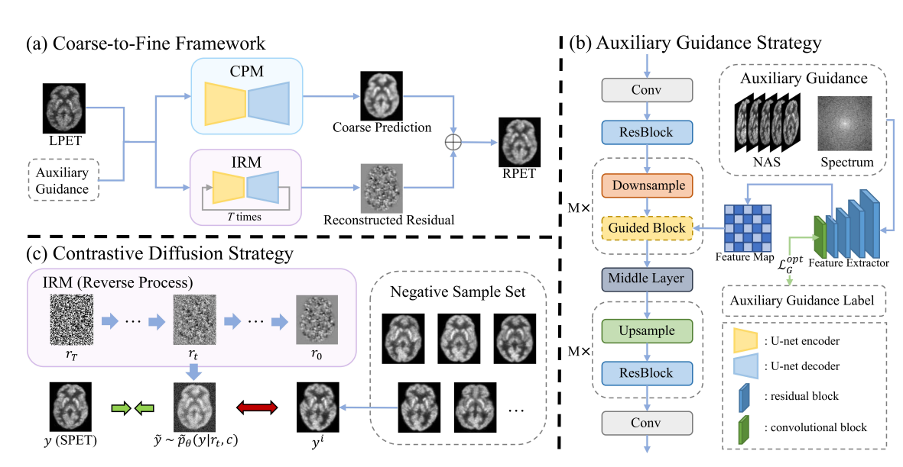 |                              无                              |          Ultra-low Dose PET Imaging Challenge 2022           | n=206                                                        | 2023 | MICCAI |
| CT Kernel Conversion Using Multi-domainImage-to-Image Translation with Generator-Guided Contrastive Learning | https://doi.org/10.1007/978-3-031-43999-5_33                 |                       CT软核到硬核                        | GAN+中间特征层的对比学习（不明白这么做能有什么好处）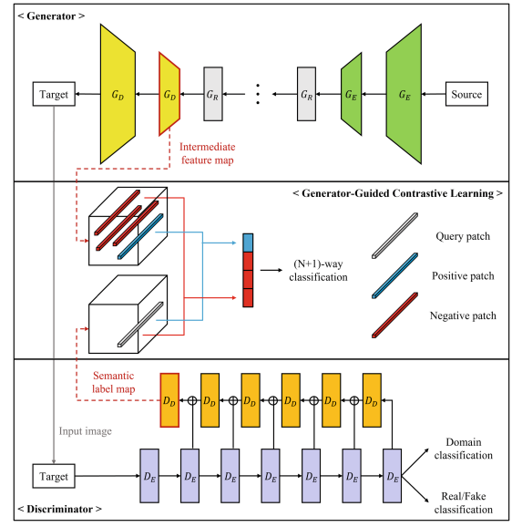 |                              无                              |                          自建数据库                          | 胸部CT                                                       | 2023 | MICCAI |
| DiffMix: Diffusion Model-Based Data Synthesis for Nuclei Segmentation and Classification in Imbalanced Pathology Image Datasets | https://link.springer.com/chapter/10.1007/978-3-031-43898-1_33 |                  生成样本辅助细胞核分类                   | Diffusion模型（SDM）+生成自定义分割Mask的图像用于训练（感觉可以有所借鉴） |                              无                              |                            GLySAC                            | n=59                                                         | 2023 | MICCAI |
| DisC-Diff: Disentangled Conditional Diffusion Model for Multi-Contrast MRI Super-Resolution | https://doi.org/10.1007/978-3-031-43999-5_37                 |                          MRI超分                          | 修改了Diffusion中的U-net结构，将条件信息每一路单独通过一个SE-Block，以及混合后共同通过一个 |                              无                              |                             IXI                              | 略                                                           | 2023 | MICCAI |
| Faithful Synthesis of Low-Dose Contrast-Enhanced Brain MRI Scans Using Noise-Preserving Conditional GANs | https://link.springer.com/chapter/10.1007/978-3-031-43895-0_57 |                生成不同剂量的GBCA的MRI图片                | GAN+维尔斯特拉距离损失函数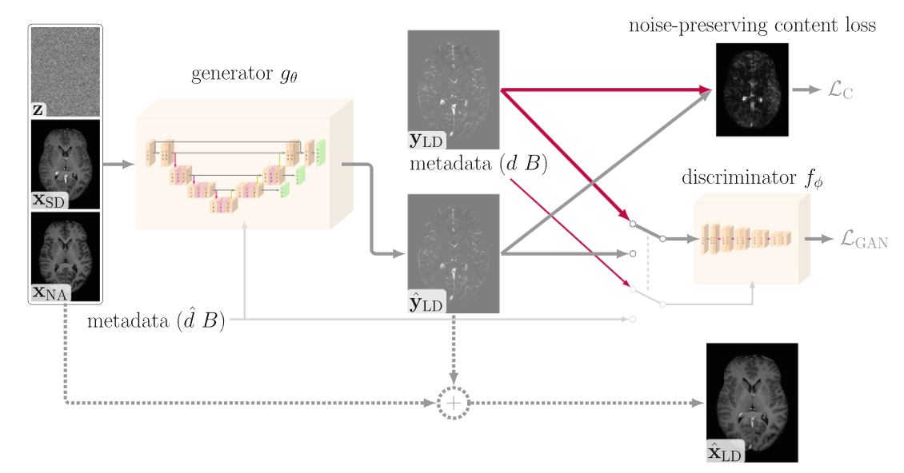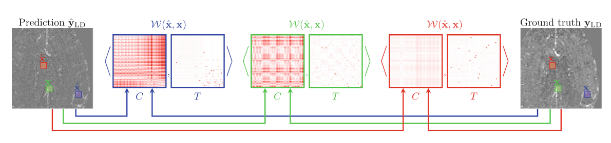 |                              无                              |                      自建数据+BraTs检验                      | 略                                                           | 2023 | MICCAI |
| Feature-Conditioned Cascaded Video Diffusion Models for Precise Echocardiogram Synthesis | https://link.springer.com/chapter/10.1007/978-3-031-43999-5_14 |         单个图像生成合理的视频序列及临床参数调节          | 利用单帧以及临床参数生成一段视频，感觉不太靠谱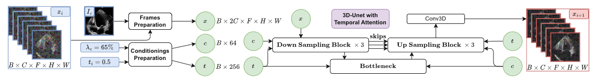 | 将生成的视频序列替换正常的序列，平衡样本的种类，从而提高任务的性能 |                   EchoNet-dynamic dataset                    | 心脏超声数据                                                 | 2023 | MICCAI |
| Generating Realistic Brain MRIs via a Conditional Diffusion Probabilistic Model | https://link.springer.com/chapter/10.1007/978-3-031-43993-3_2) |                      2dMRI生成3dMRI                       | 有n个序列，训练每次生成其中的随机几个序列，推断每次根据前两个序列生成后两个序列（可以借鉴）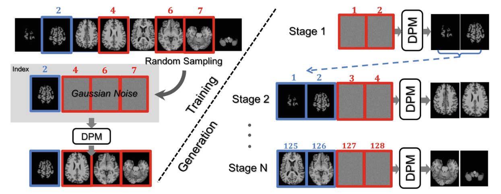 |                              无                              |                      ADNI-1，UCSF，SRI                       | T1（脑部）                                                   | 2023 | MICCAI |
| Inter-slice Consistency for Unpaired Low-Dose CT Denoising Using Boosted Contrastive Learning | https://link.springer.com/chapter/10.1007/978-3-031-43907-0_23 |                       低剂量CT去噪                        | U-net+对比学习，将图像划分为patch，输出的位置为正样本，其余位置为负样本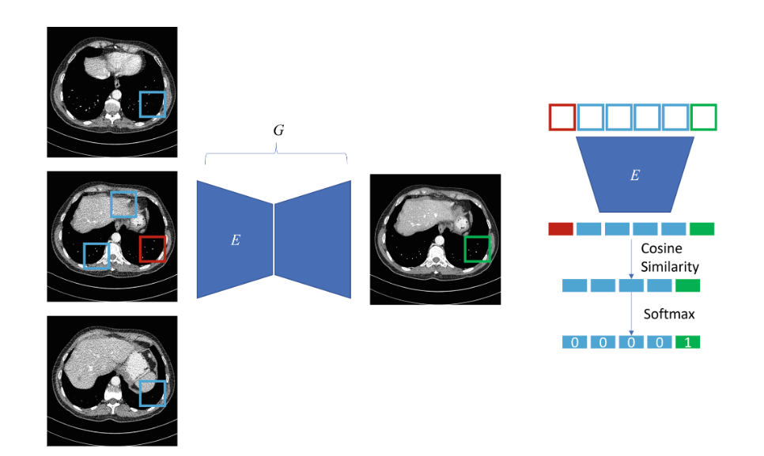 |                              无                              |       NIH-AAPM-Mayo Clinic Low Dose CT Grand Challenge       | 配对的低剂量CT图像                                           | 2023 | MICCAI |
| PET-Diffusion: Unsupervised PET Enhancement Based on the Latent Diffusion Model | https://link.springer.com/chapter/10.1007/978-3-031-43907-0_1 |                 低剂量PET生成标准剂量PET                  | 训练过程用LDM正向将SPET转换为潜变量，通过潜变量以及CT图像训练带有交叉注意力机制的U-Net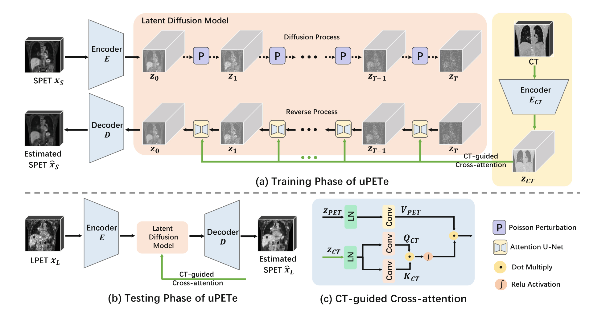 |                              无                              |                   SPET、LPET、CT （本文）                    | 100个SPET训练，30个SPET与LPET配对进行测试                    | 2023 | MICCAI |
| Pre-trained Diffusion Models for Plug-and-Play Medical Image Enhancement | https://link.springer.com/chapter/10.1007/978-3-031-43898-1_1 |            通用的CT、MRI质量增强（去噪、超分）            | diffuison＋去噪建模（以后可以用这个预训练模型提高图像质量）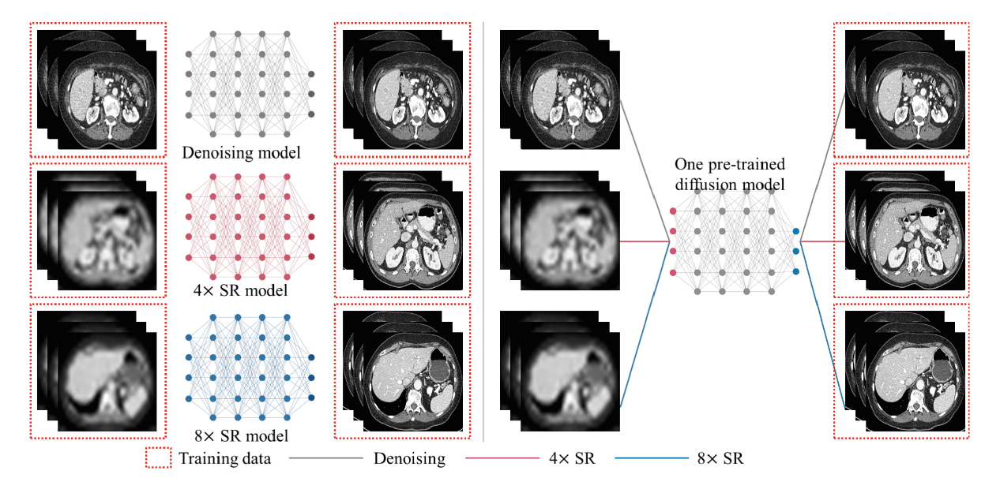 |                              无                              | AAPM Low Dose CT Grand Challenge abd、 ACDC 、M&Ms1-2 、CMRxMotion | 略                                                           | 2023 | MICCAI |

## Nature子刊

| 论文名                                        | 链接 | 任务 |                             方法                             | 下游任务 |                   数据集                   | 数据描述 | 时间 |        发表        |
| --------------------------------------------- | --------------------------------------------------------- | :-------------------------------------------------------: | :----------------------------------------------------------: | :----------------------------------------------------------: | :----------------------------------------: | ------------------------------------------------------------ | :--: | :----------------: |
| MRI Cross-Modality Image-to-Image Translation | https://www.nature.com/articles/s41598-020-60520-6        |                      跨模态图像迁移                       | 将CGAN用于跨膜态图像生成，将生成图片和原始图片一起用于下游任务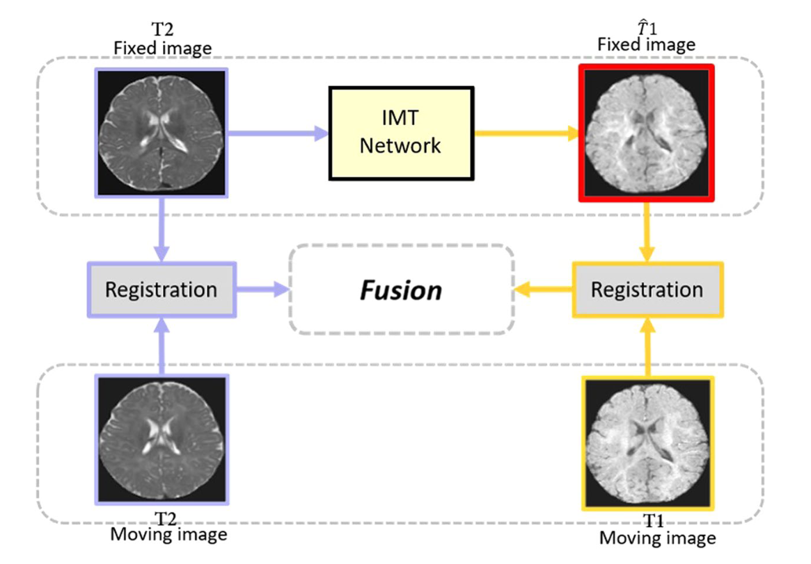 |                        图像配准、分割                        | BraTs2015、Iseg2017、MRBrain13、ADNI、RIRE | 略                                                           | 2020 | scientific reports |

Nature子刊级别的这类文章较少，而且不是很强调方法，更加强调下游任务与叙述完整性

## 其他

| 论文名                                                       | 链接 | 任务 |                             方法                             | 下游任务 |                            数据集                            | 数据描述 | 时间 | 发表 |
| ------------------------------------------------------------ | --------------------------------------------------------- | :-------------------------------------------------------: | :----------------------------------------------------------: | :----------------------------------------------------------: | :----------------------------------------------------------: | ------------------------------------------------------------ | :--: | ---- |
| Unite and Conquer: Cross Dataset Multimodal Synthesis using Diffusion Models | https://arxiv.org/pdf/2212.00793.pdf                      |                        多模态融合                         | 没看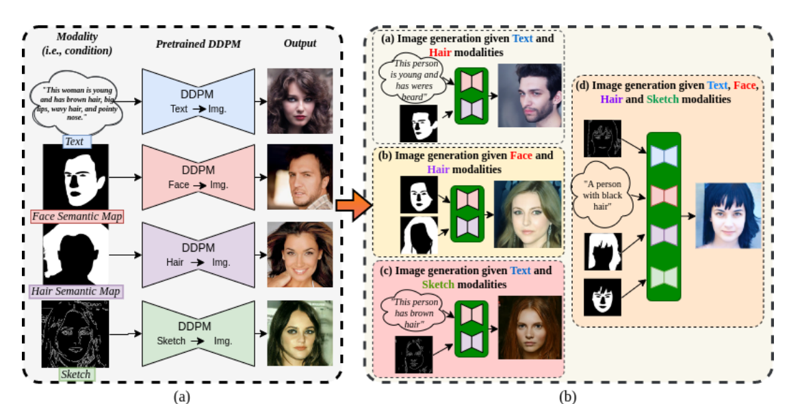 |                              略                              |                              略                              | 略                                                           | 2023 | CVPR |
| PoseDiffusion: Solving Pose Estimation via Diffusion-aided Bundle Adjustment | https://arxiv.org/pdf/2303.06840.pdf                      |                      多模态图像融合                       | DDFM（还没看，感觉值得细看）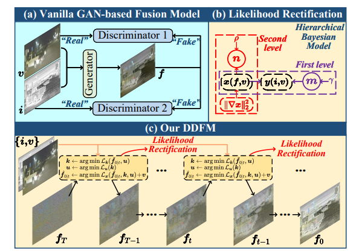 |                              略                              |                              略                              | 略                                                           | 2023 | ICCV |
| Incremental Cross-view Mutual Distillation for Self-supervised Medical CT Synthesis | https://arxiv.org/pdf/2112.10325.pdf                      |                       CT厚切到薄切                        | x,y,z三轴互相知识蒸馏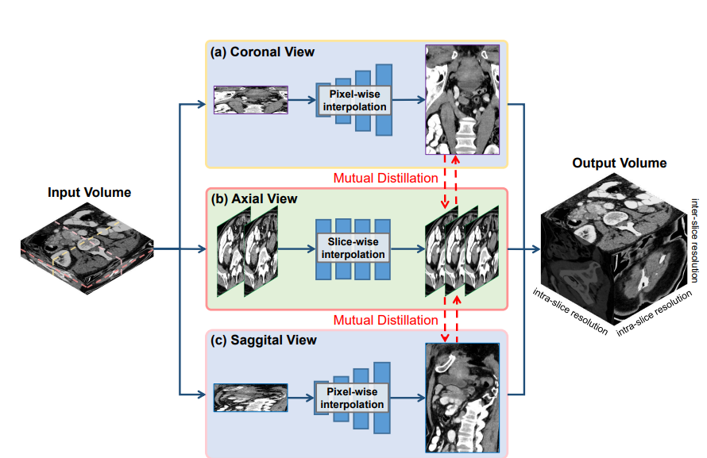 |                              无                              |           Medical Segmentation Decathlon challenge           | 肝脏、结肠和肝血管部位                                       | 2022 | CVPR |
| Data augmentation using learned transformations for one-shot medical image segmentation | https://arxiv.org/pdf/1902.09383.pdf                      |                      生成新的MRI图像                      | 学习两个不同MRI图像的外形变化和空间结构变化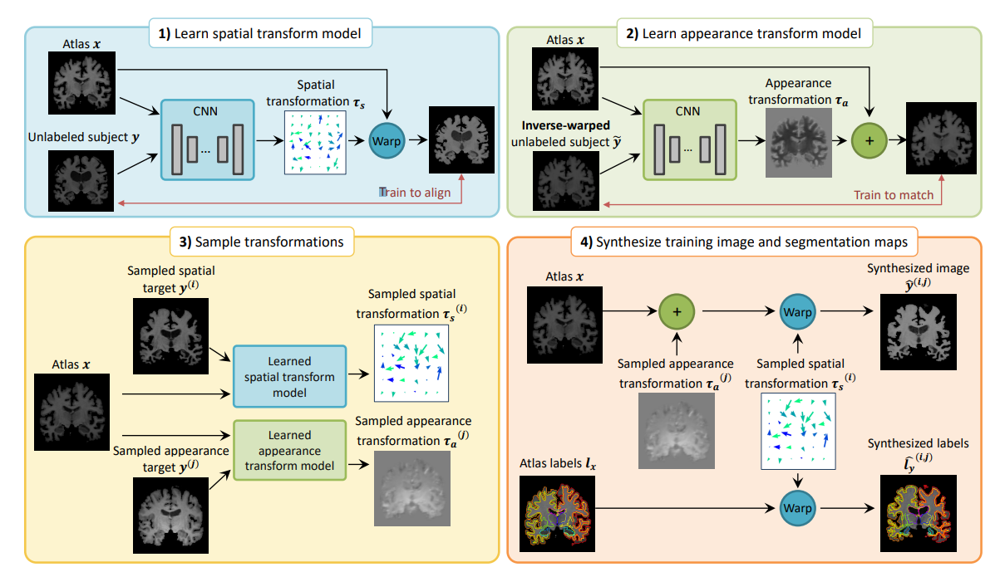 |                           图像分割                           | ADNI , OASIS , ABIDE , ADHD200  MCIC , PPMI , HABS , and Harvard GSP | 脑部MRI                                                      | 2019 | CVPR |

总结：

- BraTs来自神经胶质瘤患者，可以根据采集患者的不同来区分我们与他们的库，但需要与医生进行探讨

- BraTs2021样本数为1200多例，到目前可能已经达到2000例，我们的库样本为700例，拼数量不是特别现实，但我们的库普遍质量强于BraTs（分辨率）

- 目前做模态迁移的工作很多，也有聚焦于增强模态的，但也并未出现一个统一跨多部位的增强模态的工作，大多都局限于同一个数据库

- 目前见到了一个统一的医疗图像增强的工作，但其主要关注的是图像超分、去噪，并不是增强模态，以后可以将这个工作用于数据处理

  