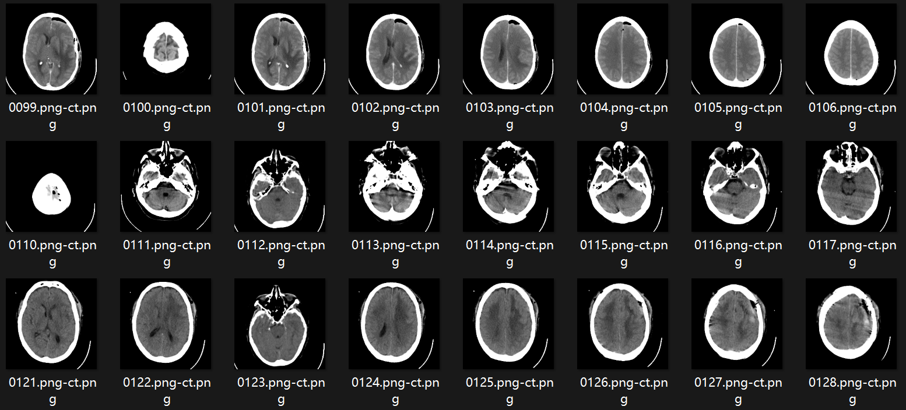

### MRI模态迁移

非增强生成增强

https://aapm.onlinelibrary.wiley.com/doi/10.1002/acm2.14120

Contrast-enhanced MRI synthesis using dense-dilated residual convolutions based 3D network toward elimination of gadolinium in neuro-oncology

影响因子：2.1

方法：残差网络＋U-net

数据库：BraTS2021

- 模态：T1,T2,FLAIR,T1-CE
- 数据量：training set（n=800），validation set（n=200），test set（n=251）
- 尺寸： $180\times 180 \times 128$
- 链接：

复现效果：

利用对抗生成网络进行多模态CT的超分

https://ieeexplore.ieee.org/abstract/document/9098322

Transfer-Gan: Multimodal Ct Image Super-Resolution Via Transfer Generative Adversarial Networks

影响因子：6.6（ISBI）

判别器：VGG  生成器：ESRGAN

数据库：未提供

- 模态：NCCT、CTP、CTA
- 数据量：9名患者，共4382张slice，分辨率$512\times 512$

代码：未提供

CycleGAN MRI和CT之间迁移

https://link.springer.com/chapter/10.1007/978-981-99-1414-2_34

CycleGAN Implementation on Cross-Modality Transfer Between Magnetic Resonance Image (MRI) and Computed Tomography (CT) Images

数据库：mri2ct

- 模态：CT、MRI
- 数据量：training set (n=367)     test set(n=67)
- 链接：[mri2ct (kaggle.com)](https://www.kaggle.com/datasets/delladominic/mri2ct/)

图例：

方法：CycleGAN

https://www.sciencedirect.com/science/article/abs/pii/S0895611120300793

利用对抗学习的方式，用MRI迁移到CT域，之后进行CT和MRI的图像分割

MMTLNet: Multi-Modality Transfer Learning Network with adversarial training for 3D whole heart segmentation

用Cycle-GAN的方法通过MRI生成合成CT图像，其实就是在做分割

训练时MRI与CT不配对

https://link.springer.com/chapter/10.1007/978-3-030-33391-1_8

Cross-Modality Knowledge Transfer for Prostate Segmentation from CT Scans

Make-A-Volume: Leveraging Latent Diffusion Models for Cross-Modality 3D Brain MRI Synthesis

https://paperswithcode.com/paper/make-a-volume-leveraging-latent-diffusion

模态：T1，T2

任务：图像合成

数据集：S2M（本文提出，91训练，20测试）、 RIRE（14训练，3测试，West, J., Fitzpatrick, J.M., Wang, M.Y., Dawant, B.M., Maurer Jr, C.R., Kessler, R.M., Maciunas, R.J., Barillot, C., Lemoine, D., Collignon, A., et al.: Comparison and evaluation of retrospective intermodality brain image registration techniques. Journal of computer assisted tomography 21(4), 554–568 (1997)）

分辨率：256×256

训练资源：A100×1

方法：预训练一个2D的diffusion，然后加一些层去fintune一个3D的diffusion，基本模型选用的是LDM

PET-Diffusion: Unsupervised PET Enhancement Based on the Latent Diffusion Model

https://link.springer.com/chapter/10.1007/978-3-031-43907-0_1

任务：低剂量PET生成标准剂量PET

数据集：SPET、LPET、CT （本文）	100个SPET训练，30个SPET与LPET配对进行测试

分辨率：256×256

方法：

训练过程用LDM正向将SPET转换为潜变量，通过潜变量以及CT图像训练带有交叉注意力机制的U-Net

反向过程用低剂量PET（LPET）进行潜变量空间映射后重建标准剂量PET（SPET）

Segmentation of Kidney Tumors on Non-Contrast CT Images Using Protuberance Detection Network

https://link.springer.com/chapter/10.1007/978-3-031-43990-2_2

任务：肾肿瘤分割

方法：肾脏区域检测网络，突起检测网络、融合为肿瘤检测网络

数据集：(KiTS19, KiTS21)

模态：CECT（210 training， 90 testing）、NCCT（108）不配对，CECT有掩膜

Virtual Contrast-Enhanced Magnetic Resonance Images Synthesis for Patients With Nasopharyngeal Carcinoma Using Multimodality-Guided Synergistic Neural Network

https://www.sciencedirect.com/science/article/abs/pii/S0360301621031151

（北航未订阅）

任务：T1+T2生成T1CE

Synthesis of Contrast-Enhanced Breast MRI Using Multi-b-Value DWI-based Hierarchical Fusion Network with Attention Mechanism

https://arxiv.org/abs/2307.00895

任务：多b值DWI加T1生成CE-T1

方法：U-net中间层融合，引入了差分的方式控制b值

数据：自建数据，612训练，513测试

 

https://arxiv.org/abs/2303.14081

任务：MRI多图像合成单图像

数据集：BRATS 2018， IXI datasets(140:25:35)

方法：

- U-net的通道映射加入小波变换进行滤波

- 采用了一种调整条件输入权重的方式

  

An Explainable Deep Framework: Towards Task-Specific Fusion for Multi-to-One MRI Synthesis

任务：多模态合成多模态

方法：引入任务编码，图例：（1011，0100），引入任务权重和任务注意力

数据集：BraTs2021

[Home](https://link.springer.com/) [Medical Image Computing and Computer Assisted Intervention – MICCAI 2023](https://link.springer.com/book/10.1007/978-3-031-43999-5) Conference paper

Alias-Free Co-modulated Network for Cross-Modality Synthesis and Super-Resolution of MR Images

https://link.springer.com/chapter/10.1007/978-3-031-43999-5_7

数据集：

